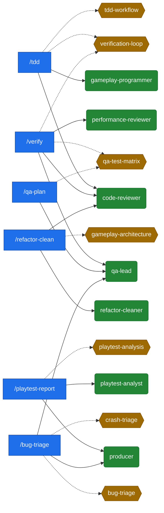
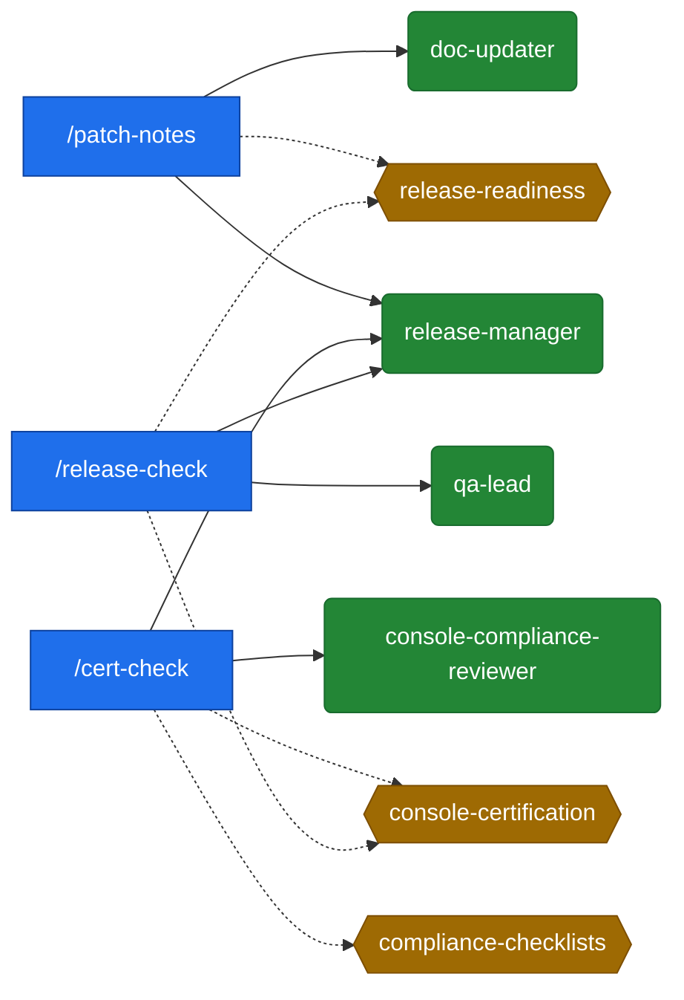
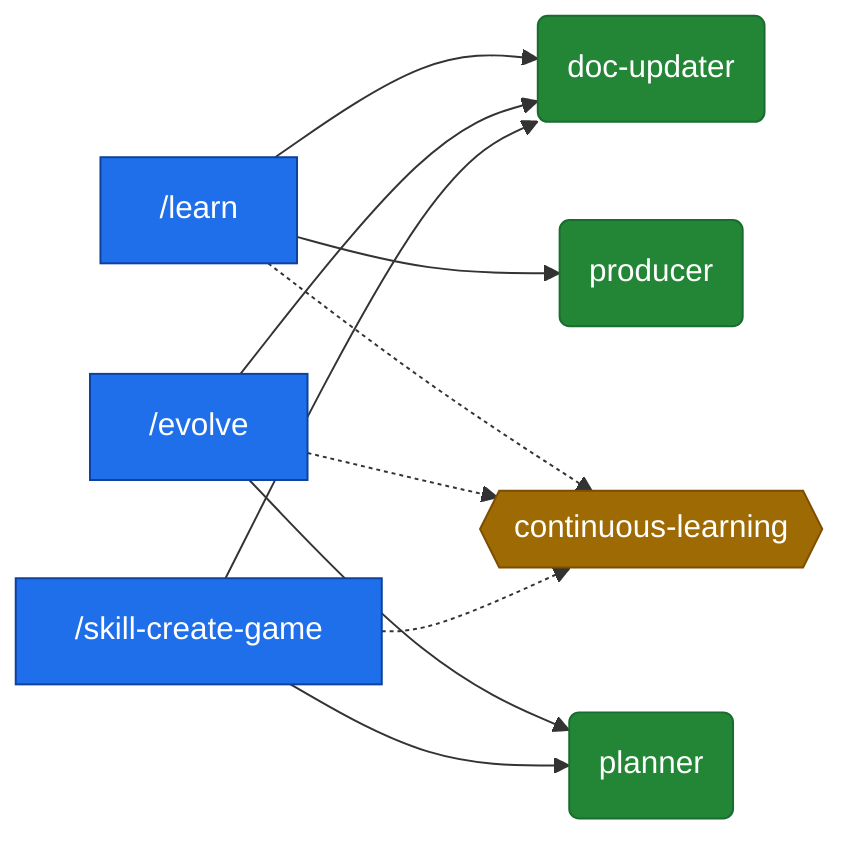
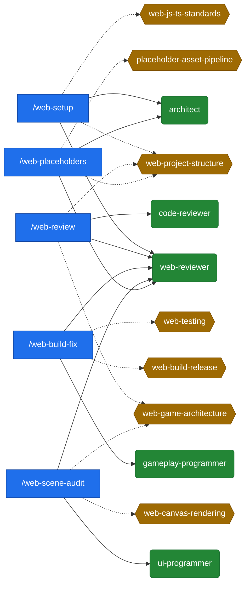

# Dependency Graph

Generated from `commands/*.md` (Invokes Agents, Required Skills) and the section grouping of `command-agent-map.md`. Update with `npm run sync:graph` — do not edit by hand.

Legend: rectangles are commands, rounded nodes are agents (solid arrows = invokes), hexagons are skills (dotted arrows = requires).

## Core Planning and Documentation

```mermaid
graph LR
  c_context["/context"]:::command
  a_producer("producer"):::agent
  a_planner("planner"):::agent
  s_orchestration_patterns{{"orchestration-patterns"}}:::skill
  s_milestone_planning{{"milestone-planning"}}:::skill
  c_plan["/plan"]:::command
  s_vertical_slice_planning{{"vertical-slice-planning"}}:::skill
  c_gdd["/gdd"]:::command
  a_gdd_designer("gdd-designer"):::agent
  a_systems_designer("systems-designer"):::agent
  s_gdd_writing{{"gdd-writing"}}:::skill
  s_core_loop_design{{"core-loop-design"}}:::skill
  c_tech_design["/tech-design"]:::command
  a_technical_design_lead("technical-design-lead"):::agent
  a_architect("architect"):::agent
  s_technical_design_document{{"technical-design-document"}}:::skill
  s_gameplay_architecture{{"gameplay-architecture"}}:::skill
  c_vertical_slice["/vertical-slice"]:::command
  c_milestone_plan["/milestone-plan"]:::command
  s_risk_register{{"risk-register"}}:::skill
  c_orchestrate["/orchestrate"]:::command
  c_full_game["/full-game"]:::command
  a_gameplay_programmer("gameplay-programmer"):::agent
  a_ui_programmer("ui-programmer"):::agent
  a_ui_ux_designer("ui-ux-designer"):::agent
  a_2d_artist("2d-artist"):::agent
  a_code_reviewer("code-reviewer"):::agent
  a_qa_lead("qa-lead"):::agent
  a_performance_reviewer("performance-reviewer"):::agent
  a_release_manager("release-manager"):::agent
  a_Engine_specific__unity_reviewer___unreal_reviewer___godot_reviewer__based_on_target_("Engine-specific: unity-reviewer | unreal-reviewer | godot-reviewer (based on target)"):::agent
  s_ui_hud_patterns{{"ui-hud-patterns"}}:::skill
  s_input_abstraction{{"input-abstraction"}}:::skill
  s_placeholder_asset_pipeline{{"placeholder-asset-pipeline"}}:::skill
  s_performance_budgeting{{"performance-budgeting"}}:::skill
  s_qa_test_matrix{{"qa-test-matrix"}}:::skill
  s_release_readiness{{"release-readiness"}}:::skill
  s_unity_project_structure{{"unity-project-structure"}}:::skill
  s_unity_build_release{{"unity-build-release"}}:::skill
  s_unreal_project_structure{{"unreal-project-structure"}}:::skill
  s_unreal_build_release{{"unreal-build-release"}}:::skill
  s_godot_project_structure{{"godot-project-structure"}}:::skill
  s_godot_build_release{{"godot-build-release"}}:::skill
  c_update_docs["/update-docs"]:::command
  a_doc_updater("doc-updater"):::agent
  s_workflow_gdd_writing{{"workflow/gdd-writing"}}:::skill
  s_workflow_technical_design_document{{"workflow/technical-design-document"}}:::skill
  s_workflow_continuous_learning{{"workflow/continuous-learning"}}:::skill
  c_context --> a_producer
  c_context --> a_planner
  c_context -.-> s_orchestration_patterns
  c_context -.-> s_milestone_planning
  c_plan --> a_planner
  c_plan -.-> s_vertical_slice_planning
  c_plan -.-> s_milestone_planning
  c_gdd --> a_gdd_designer
  c_gdd --> a_systems_designer
  c_gdd -.-> s_gdd_writing
  c_gdd -.-> s_core_loop_design
  c_tech_design --> a_technical_design_lead
  c_tech_design --> a_architect
  c_tech_design -.-> s_technical_design_document
  c_tech_design -.-> s_gameplay_architecture
  c_vertical_slice --> a_planner
  c_vertical_slice --> a_producer
  c_vertical_slice --> a_gdd_designer
  c_vertical_slice -.-> s_vertical_slice_planning
  c_milestone_plan --> a_producer
  c_milestone_plan --> a_planner
  c_milestone_plan -.-> s_milestone_planning
  c_milestone_plan -.-> s_risk_register
  c_orchestrate --> a_planner
  c_orchestrate -.-> s_orchestration_patterns
  c_full_game --> a_planner
  c_full_game --> a_gdd_designer
  c_full_game --> a_systems_designer
  c_full_game --> a_architect
  c_full_game --> a_technical_design_lead
  c_full_game --> a_gameplay_programmer
  c_full_game --> a_ui_programmer
  c_full_game --> a_ui_ux_designer
  c_full_game --> a_2d_artist
  c_full_game --> a_producer
  c_full_game --> a_code_reviewer
  c_full_game --> a_qa_lead
  c_full_game --> a_performance_reviewer
  c_full_game --> a_release_manager
  c_full_game --> a_Engine_specific__unity_reviewer___unreal_reviewer___godot_reviewer__based_on_target_
  c_full_game -.-> s_gdd_writing
  c_full_game -.-> s_core_loop_design
  c_full_game -.-> s_technical_design_document
  c_full_game -.-> s_vertical_slice_planning
  c_full_game -.-> s_milestone_planning
  c_full_game -.-> s_gameplay_architecture
  c_full_game -.-> s_ui_hud_patterns
  c_full_game -.-> s_input_abstraction
  c_full_game -.-> s_placeholder_asset_pipeline
  c_full_game -.-> s_performance_budgeting
  c_full_game -.-> s_qa_test_matrix
  c_full_game -.-> s_release_readiness
  c_full_game -.-> s_unity_project_structure
  c_full_game -.-> s_unity_build_release
  c_full_game -.-> s_unreal_project_structure
  c_full_game -.-> s_unreal_build_release
  c_full_game -.-> s_godot_project_structure
  c_full_game -.-> s_godot_build_release
  c_update_docs --> a_doc_updater
  c_update_docs -.-> s_workflow_gdd_writing
  c_update_docs -.-> s_workflow_technical_design_document
  c_update_docs -.-> s_workflow_continuous_learning
  classDef command fill:#1f6feb,color:#ffffff,stroke:#0d419d
  classDef agent fill:#238636,color:#ffffff,stroke:#196c2e
  classDef skill fill:#9e6a03,color:#ffffff,stroke:#7d4e00
```

## Verification, Testing, and Review

## Design Commands

```mermaid
graph LR
  c_combat_design["/combat-design"]:::command
  a_combat_designer("combat-designer"):::agent
  a_systems_designer("systems-designer"):::agent
  s_combat_design{{"combat-design"}}:::skill
  c_economy_balance["/economy-balance"]:::command
  a_economy_designer("economy-designer"):::agent
  s_economy_balancing{{"economy-balancing"}}:::skill
  c_level_beat["/level-beat"]:::command
  a_level_designer("level-designer"):::agent
  s_level_design{{"level-design"}}:::skill
  c_quest_design["/quest-design"]:::command
  a_narrative_designer("narrative-designer"):::agent
  s_quest_design{{"quest-design"}}:::skill
  c_dialogue_design["/dialogue-design"]:::command
  a_gdd_designer("gdd-designer"):::agent
  s_narrative_design{{"narrative-design"}}:::skill
  s_dialogue_content_pipeline{{"dialogue-content-pipeline"}}:::skill
  c_procgen_design["/procgen-design"]:::command
  a_gameplay_programmer("gameplay-programmer"):::agent
  s_procgen_design{{"procgen-design"}}:::skill
  c_onboarding["/onboarding"]:::command
  a_ui_ux_designer("ui-ux-designer"):::agent
  s_onboarding_tutorial_design{{"onboarding-tutorial-design"}}:::skill
  c_liveops_brief["/liveops-brief"]:::command
  a_liveops_manager("liveops-manager"):::agent
  a_telemetry_analyst("telemetry-analyst"):::agent
  s_liveops_design{{"liveops-design"}}:::skill
  c_telemetry_plan["/telemetry-plan"]:::command
  s_telemetry_instrumentation{{"telemetry-instrumentation"}}:::skill
  c_combat_design --> a_combat_designer
  c_combat_design --> a_systems_designer
  c_combat_design -.-> s_combat_design
  c_economy_balance --> a_economy_designer
  c_economy_balance --> a_systems_designer
  c_economy_balance -.-> s_economy_balancing
  c_level_beat --> a_level_designer
  c_level_beat --> a_systems_designer
  c_level_beat -.-> s_level_design
  c_quest_design --> a_narrative_designer
  c_quest_design --> a_systems_designer
  c_quest_design -.-> s_quest_design
  c_dialogue_design --> a_narrative_designer
  c_dialogue_design --> a_gdd_designer
  c_dialogue_design -.-> s_narrative_design
  c_dialogue_design -.-> s_dialogue_content_pipeline
  c_procgen_design --> a_systems_designer
  c_procgen_design --> a_level_designer
  c_procgen_design --> a_gameplay_programmer
  c_procgen_design -.-> s_procgen_design
  c_procgen_design -.-> s_level_design
  c_onboarding --> a_ui_ux_designer
  c_onboarding --> a_systems_designer
  c_onboarding -.-> s_onboarding_tutorial_design
  c_liveops_brief --> a_liveops_manager
  c_liveops_brief --> a_telemetry_analyst
  c_liveops_brief -.-> s_liveops_design
  c_telemetry_plan --> a_telemetry_analyst
  c_telemetry_plan --> a_systems_designer
  c_telemetry_plan -.-> s_telemetry_instrumentation
  classDef command fill:#1f6feb,color:#ffffff,stroke:#0d419d
  classDef agent fill:#238636,color:#ffffff,stroke:#196c2e
  classDef skill fill:#9e6a03,color:#ffffff,stroke:#7d4e00
```

## Technical Budget and Systems Review

```mermaid
graph LR
  c_perf_budget["/perf-budget"]:::command
  a_performance_reviewer("performance-reviewer"):::agent
  a_technical_artist("technical-artist"):::agent
  s_performance_budgeting{{"performance-budgeting"}}:::skill
  c_memory_budget["/memory-budget"]:::command
  s_memory_budgeting{{"memory-budgeting"}}:::skill
  c_multiplayer_review["/multiplayer-review"]:::command
  a_network_programmer("network-programmer"):::agent
  a_architect("architect"):::agent
  s_multiplayer_netcode_patterns{{"multiplayer-netcode-patterns"}}:::skill
  c_save_system_review["/save-system-review"]:::command
  a_technical_design_lead("technical-design-lead"):::agent
  a_gameplay_programmer("gameplay-programmer"):::agent
  s_save_system_patterns{{"save-system-patterns"}}:::skill
  c_ui_flow_review["/ui-flow-review"]:::command
  a_ui_ux_designer("ui-ux-designer"):::agent
  a_ui_programmer("ui-programmer"):::agent
  s_ui_hud_patterns{{"ui-hud-patterns"}}:::skill
  s_accessibility_design{{"accessibility-design"}}:::skill
  c_audio_pass["/audio-pass"]:::command
  a_audio_designer("audio-designer"):::agent
  a_qa_lead("qa-lead"):::agent
  s_audio_implementation{{"audio-implementation"}}:::skill
  c_localization_pass["/localization-pass"]:::command
  a_narrative_designer("narrative-designer"):::agent
  a_doc_updater("doc-updater"):::agent
  s_localization_pipeline{{"localization-pipeline"}}:::skill
  c_accessibility_pass["/accessibility-pass"]:::command
  a_accessibility_reviewer("accessibility-reviewer"):::agent
  c_animation_pass["/animation-pass"]:::command
  a_animation_programmer("animation-programmer"):::agent
  a_2d_artist("2d-artist"):::agent
  s_2d_animation_pipeline{{"2d-animation-pipeline"}}:::skill
  s_animation_state_patterns{{"animation-state-patterns"}}:::skill
  s_ui_animation_pipeline{{"ui-animation-pipeline"}}:::skill
  c_input_review["/input-review"]:::command
  s_input_abstraction{{"input-abstraction"}}:::skill
  c_game_feel_pass["/game-feel-pass"]:::command
  s_game_feel_design{{"game-feel-design"}}:::skill
  c_art_2d_pass["/art-2d-pass"]:::command
  s_sprite_pipeline{{"sprite-pipeline"}}:::skill
  s_tilemap_pipeline{{"tilemap-pipeline"}}:::skill
  s_placeholder_asset_pipeline{{"placeholder-asset-pipeline"}}:::skill
  s_generated_raster_asset_pipeline{{"generated-raster-asset-pipeline"}}:::skill
  s_art_bible{{"art-bible"}}:::skill
  c_ui_asset_pass["/ui-asset-pass"]:::command
  s_ui_asset_pipeline{{"ui-asset-pipeline"}}:::skill
  c_tools_pass["/tools-pass"]:::command
  a_tools_programmer("tools-programmer"):::agent
  a_code_reviewer("code-reviewer"):::agent
  s_tools_pipeline_patterns{{"tools-pipeline-patterns"}}:::skill
  c_perf_budget --> a_performance_reviewer
  c_perf_budget --> a_technical_artist
  c_perf_budget -.-> s_performance_budgeting
  c_memory_budget --> a_performance_reviewer
  c_memory_budget --> a_technical_artist
  c_memory_budget -.-> s_memory_budgeting
  c_multiplayer_review --> a_network_programmer
  c_multiplayer_review --> a_architect
  c_multiplayer_review -.-> s_multiplayer_netcode_patterns
  c_save_system_review --> a_technical_design_lead
  c_save_system_review --> a_gameplay_programmer
  c_save_system_review -.-> s_save_system_patterns
  c_ui_flow_review --> a_ui_ux_designer
  c_ui_flow_review --> a_ui_programmer
  c_ui_flow_review -.-> s_ui_hud_patterns
  c_ui_flow_review -.-> s_accessibility_design
  c_audio_pass --> a_audio_designer
  c_audio_pass --> a_qa_lead
  c_audio_pass -.-> s_audio_implementation
  c_localization_pass --> a_narrative_designer
  c_localization_pass --> a_ui_ux_designer
  c_localization_pass --> a_doc_updater
  c_localization_pass -.-> s_localization_pipeline
  c_accessibility_pass --> a_accessibility_reviewer
  c_accessibility_pass --> a_ui_ux_designer
  c_accessibility_pass -.-> s_accessibility_design
  c_accessibility_pass -.-> s_ui_hud_patterns
  c_animation_pass --> a_animation_programmer
  c_animation_pass --> a_2d_artist
  c_animation_pass --> a_technical_artist
  c_animation_pass -.-> s_2d_animation_pipeline
  c_animation_pass -.-> s_animation_state_patterns
  c_animation_pass -.-> s_ui_animation_pipeline
  c_input_review --> a_gameplay_programmer
  c_input_review --> a_ui_programmer
  c_input_review -.-> s_input_abstraction
  c_game_feel_pass --> a_gameplay_programmer
  c_game_feel_pass --> a_ui_ux_designer
  c_game_feel_pass --> a_audio_designer
  c_game_feel_pass -.-> s_game_feel_design
  c_game_feel_pass -.-> s_ui_animation_pipeline
  c_art_2d_pass --> a_2d_artist
  c_art_2d_pass --> a_technical_artist
  c_art_2d_pass -.-> s_sprite_pipeline
  c_art_2d_pass -.-> s_tilemap_pipeline
  c_art_2d_pass -.-> s_2d_animation_pipeline
  c_art_2d_pass -.-> s_placeholder_asset_pipeline
  c_art_2d_pass -.-> s_generated_raster_asset_pipeline
  c_art_2d_pass -.-> s_art_bible
  c_ui_asset_pass --> a_2d_artist
  c_ui_asset_pass --> a_ui_ux_designer
  c_ui_asset_pass --> a_accessibility_reviewer
  c_ui_asset_pass -.-> s_ui_asset_pipeline
  c_ui_asset_pass -.-> s_ui_animation_pipeline
  c_ui_asset_pass -.-> s_placeholder_asset_pipeline
  c_ui_asset_pass -.-> s_generated_raster_asset_pipeline
  c_ui_asset_pass -.-> s_accessibility_design
  c_tools_pass --> a_tools_programmer
  c_tools_pass --> a_code_reviewer
  c_tools_pass -.-> s_tools_pipeline_patterns
  classDef command fill:#1f6feb,color:#ffffff,stroke:#0d419d
  classDef agent fill:#238636,color:#ffffff,stroke:#196c2e
  classDef skill fill:#9e6a03,color:#ffffff,stroke:#7d4e00
```

## Release and Compliance

## Learning and Skill Evolution

## Engine-Specific Commands

```mermaid
graph LR
  c_unity_setup["/unity-setup"]:::command
  a_unity_reviewer("unity-reviewer"):::agent
  a_architect("architect"):::agent
  s_unity_project_structure{{"unity-project-structure"}}:::skill
  c_unity_review["/unity-review"]:::command
  s_unity_performance{{"unity-performance"}}:::skill
  c_unity_build_fix["/unity-build-fix"]:::command
  a_unity_build_resolver("unity-build-resolver"):::agent
  s_unity_build_release{{"unity-build-release"}}:::skill
  c_unity_scene_audit["/unity-scene-audit"]:::command
  c_unity_placeholders["/unity-placeholders"]:::command
  s_placeholder_asset_pipeline{{"placeholder-asset-pipeline"}}:::skill
  c_scene_bootstrap["/scene-bootstrap"]:::command
  s_gameplay_architecture{{"gameplay-architecture"}}:::skill
  c_unreal_setup["/unreal-setup"]:::command
  a_unreal_reviewer("unreal-reviewer"):::agent
  s_unreal_project_structure{{"unreal-project-structure"}}:::skill
  c_unreal_review["/unreal-review"]:::command
  s_unreal_performance{{"unreal-performance"}}:::skill
  c_unreal_build_fix["/unreal-build-fix"]:::command
  a_unreal_build_resolver("unreal-build-resolver"):::agent
  s_unreal_build_release{{"unreal-build-release"}}:::skill
  c_unreal_blueprint_audit["/unreal-blueprint-audit"]:::command
  s_unreal_blueprint_patterns{{"unreal-blueprint-patterns"}}:::skill
  c_godot_setup["/godot-setup"]:::command
  a_godot_reviewer("godot-reviewer"):::agent
  s_godot_project_structure{{"godot-project-structure"}}:::skill
  c_godot_review["/godot-review"]:::command
  s_godot_performance{{"godot-performance"}}:::skill
  c_godot_build_fix["/godot-build-fix"]:::command
  a_godot_build_resolver("godot-build-resolver"):::agent
  s_godot_build_release{{"godot-build-release"}}:::skill
  c_godot_scene_audit["/godot-scene-audit"]:::command
  s_godot_scene_architecture{{"godot-scene-architecture"}}:::skill
  c_godot_placeholders["/godot-placeholders"]:::command
  c_unity_setup --> a_unity_reviewer
  c_unity_setup --> a_architect
  c_unity_setup -.-> s_unity_project_structure
  c_unity_review --> a_unity_reviewer
  c_unity_review -.-> s_unity_project_structure
  c_unity_review -.-> s_unity_performance
  c_unity_build_fix --> a_unity_build_resolver
  c_unity_build_fix --> a_unity_reviewer
  c_unity_build_fix -.-> s_unity_build_release
  c_unity_build_fix -.-> s_unity_project_structure
  c_unity_scene_audit --> a_unity_reviewer
  c_unity_scene_audit -.-> s_unity_project_structure
  c_unity_placeholders --> a_unity_reviewer
  c_unity_placeholders --> a_architect
  c_unity_placeholders -.-> s_unity_project_structure
  c_unity_placeholders -.-> s_placeholder_asset_pipeline
  c_scene_bootstrap --> a_unity_reviewer
  c_scene_bootstrap --> a_architect
  c_scene_bootstrap -.-> s_unity_project_structure
  c_scene_bootstrap -.-> s_gameplay_architecture
  c_scene_bootstrap -.-> s_placeholder_asset_pipeline
  c_unreal_setup --> a_unreal_reviewer
  c_unreal_setup --> a_architect
  c_unreal_setup -.-> s_unreal_project_structure
  c_unreal_review --> a_unreal_reviewer
  c_unreal_review -.-> s_unreal_project_structure
  c_unreal_review -.-> s_unreal_performance
  c_unreal_build_fix --> a_unreal_build_resolver
  c_unreal_build_fix --> a_unreal_reviewer
  c_unreal_build_fix -.-> s_unreal_build_release
  c_unreal_build_fix -.-> s_unreal_project_structure
  c_unreal_blueprint_audit --> a_unreal_reviewer
  c_unreal_blueprint_audit -.-> s_unreal_blueprint_patterns
  c_godot_setup --> a_godot_reviewer
  c_godot_setup --> a_architect
  c_godot_setup -.-> s_godot_project_structure
  c_godot_review --> a_godot_reviewer
  c_godot_review -.-> s_godot_project_structure
  c_godot_review -.-> s_godot_performance
  c_godot_build_fix --> a_godot_build_resolver
  c_godot_build_fix --> a_godot_reviewer
  c_godot_build_fix -.-> s_godot_build_release
  c_godot_build_fix -.-> s_godot_project_structure
  c_godot_scene_audit --> a_godot_reviewer
  c_godot_scene_audit -.-> s_godot_scene_architecture
  c_godot_placeholders --> a_godot_reviewer
  c_godot_placeholders --> a_architect
  c_godot_placeholders -.-> s_godot_project_structure
  c_godot_placeholders -.-> s_placeholder_asset_pipeline
  classDef command fill:#1f6feb,color:#ffffff,stroke:#0d419d
  classDef agent fill:#238636,color:#ffffff,stroke:#196c2e
  classDef skill fill:#9e6a03,color:#ffffff,stroke:#7d4e00
```

## Web Engine Commands

## Orphaned Skills

Skills referenced by no command (Required Skills) and no agent (Uses These Skills): 0 of 97. These are reachable only through the agent-skill matrix or ad hoc use — candidates for a command entry point or an explicit agent assignment.

